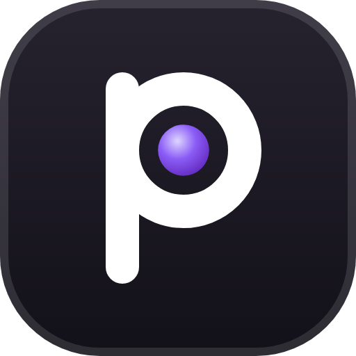
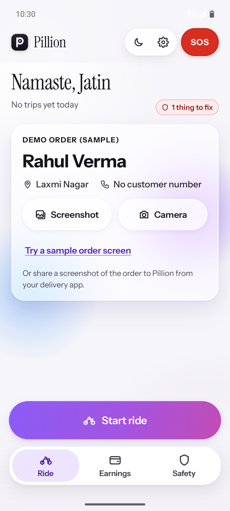
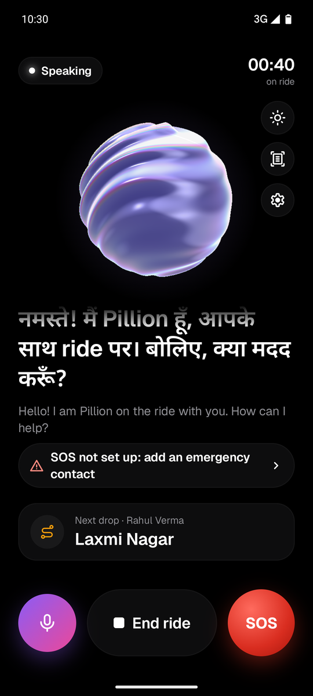
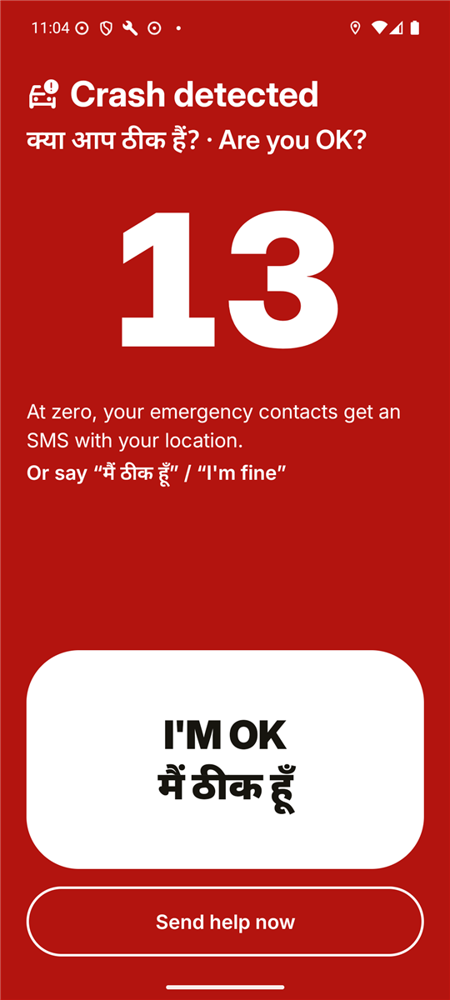
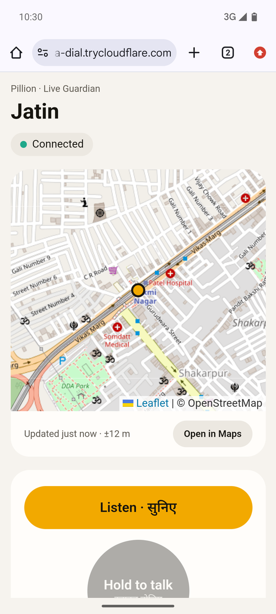
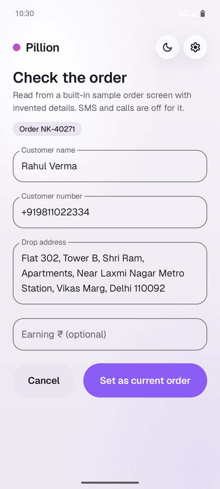
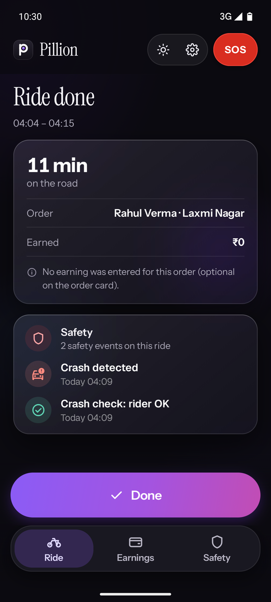
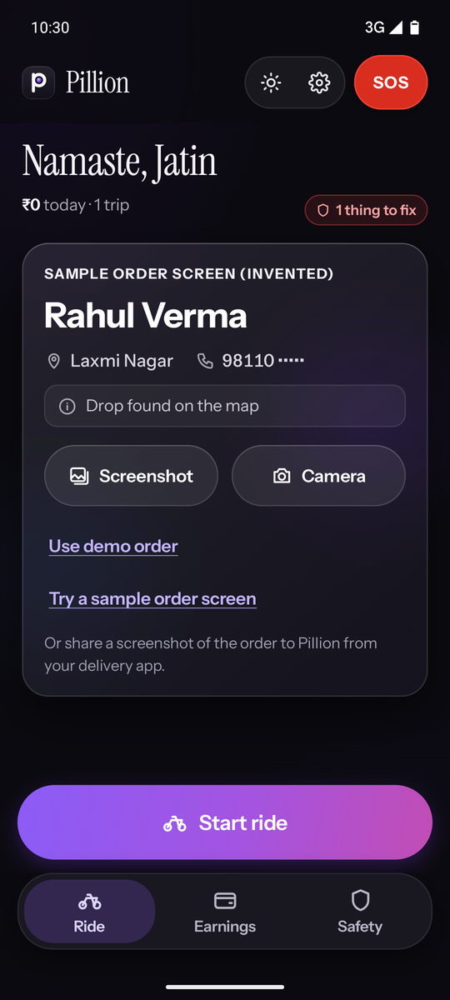
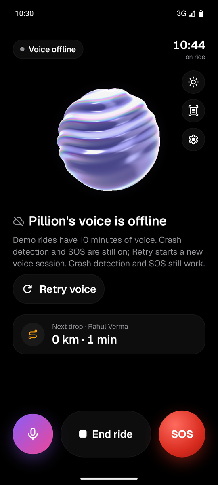
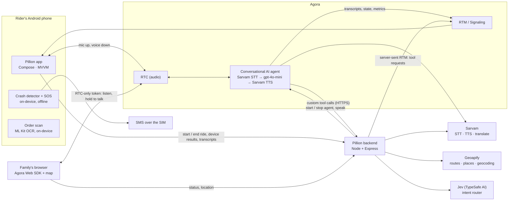

<p align="center">
  
</p>

<h1 align="center">Pillion — the AI that rides with you</h1>

<p align="center">
  A hands-free voice co-pilot for India's delivery and bike-taxi riders, in Hindi, English and Hinglish.<br>
  Built on <b>Agora Conversational AI</b> for the Agora Voice AI Hackathon.
</p>

<p align="center">
  <b><a href="https://github.com/jatinvats123/pillion/releases/latest">⬇ Download the APK</a></b> ·
  <a href="#demo-video">Demo video</a> ·
  <a href="#screenshots">Screenshots</a> ·
  <a href="#try-it-in-two-minutes">Try it in two minutes</a> ·
  <a href="#how-i-use-agora">How I use Agora</a>
</p>

---

## At a glance

**Pillion is a hands-free voice co-pilot for India's delivery and bike-taxi riders, built on Agora
Conversational AI.** Earphones in, phone in the pocket: the rider talks in Hindi, English or Hinglish, and
Pillion answers, acts and watches over them.

**What it does**
- 🎙️ **Real-time voice** in Hindi, English and Hinglish. Interrupt it mid-sentence; every Hindi line gets an
  English subtitle.
- 🧭 **Actions by voice:** next-drop ETA, the nearest petrol pump / puncture shop / ATM / toilet, today's
  earnings vs yesterday, the weather with a heat or rain warning, and a text or call to the customer after a
  spoken "yes" that the server double-checks.
- 📞 **Answers your phone calls by voice:** "Customer Rahul का call आ रहा है। उठाऊँ?" → "haan" or "baad mein".
  **Tested on 20 real calls: 19 handled correctly.**
- 📄 **Order scan:** share a screenshot of the delivery app; on-device OCR (Hindi + English) reads the
  customer's name, number and drop address.
- 🚨 **Crash detection + SOS:** the phone's sensors detect a fall, Pillion asks "Aap theek ho?", and if nobody
  answers, the emergency contacts get an SMS with the location. **Works with no internet.** Or just say
  "SOS bhejo".
- 👨‍👩‍👦 **Live Guardian:** the SOS link lets family **hear the rider, talk into their earphones and see them on
  a live map**. Pillion steps aside while they talk and comes back when they leave.
- 😴 **Fatigue reminder** after two hours of riding, dark mode after sunset, TalkBack labels, big touch targets.

**How Agora powers it**
- **Conversational AI Engine:** one agent per ride, started with the `agora-agents` SDK. Sarvam speech for
  Indian languages, Agora-managed gpt-4o-mini, tuned turn detection and barge-in, filler words generated in the
  rider's language.
- **9 custom tools:** the LLM decides and the phone acts. My backend relays each tool call to the phone with
  server-sent Signaling (RTM) messages: GPS, SMS, calls, SOS.
- **Speak API** for safety prompts that cut through anything; **Think API** to tell the agent the phone is
  ringing.
- **Voice SDK on Android** with AI noise suppression and AI echo cancellation for traffic and wind.
- **Signaling (RTM)** for live transcripts, the agent's state (it drives the glass globe) and per-turn latency
  metrics.
- **Web SDK + RTC-only tokens:** family joins the rider's channel from a browser, and the agent is stopped and
  restarted around them.

**Proof:** a signed APK (v1.0.0) and a live server, latency measured per turn, 19 of 20 calls handled
correctly, and [23 pieces of Agora SDK feedback](#agora-sdk-feedback).

## The problem

India's gig riders run their whole job on a phone they can't safely touch. The next drop, the customer who
calls twice, the "5 minute mein pahunch raha hoon" text, today's earnings: all of it lives on a screen
clipped to the handlebar or in a pocket, while they weave through traffic on a two-wheeler. Every glance is
a risk. And when a rider does go down, often alone and late at night, nobody finds out until much later.

Pillion is the friend on the pillion seat: you talk, it answers in your language, does the task, and keeps
an eye on you.

## What Pillion does

| | |
|---|---|
| 🎙️ **Voice co-pilot** | Earphones in, just talk. Hindi, English or Hinglish, real-time, and you can interrupt it mid-sentence. |
| 🧭 **Actions by voice** | Next-drop ETA, the nearest petrol pump / puncture shop / ATM / toilet, today's earnings vs yesterday, the weather where you are (with a heat or rain warning), text or call the customer after a spoken "yes". |
| 📞 **Answer calls by voice** | The phone rings in your pocket: Pillion says who it is ("Customer Rahul का call आ रहा है। उठाऊँ?", an emergency contact by name, or an unknown number) and picks up or declines when you say "haan" or "baad mein". The caller's number never leaves the phone. Off until you turn it on in Settings. **Tested on 20 real calls: 19 handled correctly.** |
| 📄 **Order scan** | Share a screenshot of the delivery app's order screen to Pillion: on-device OCR reads the customer's name, number and drop address; you confirm it on one card. |
| 🚨 **Crash check + SOS** | The phone's sensors detect a crash. Pillion asks "Aap theek ho?", then SMSes your emergency contacts with your location. **Works with no internet.** |
| 👨‍👩‍👦 **Live Guardian** | The SOS SMS carries a link: family opens it in a browser, **hears you, talks into your earphones and sees your live location**. Pillion steps aside while they're on. |
| 🔤 **English subtitles** | Every Hindi line gets an English subtitle, for riders who read English better and for family or fleet managers. |
| 😴 **Fatigue reminder** | After two hours of continuous riding, Pillion suggests a break. |

## Screenshots

<table>
  <tr>
    <td></td>
    <td></td>
    <td></td>
    <td></td>
  </tr>
  <tr>
    <td align="center">Home</td>
    <td align="center">Riding (night)</td>
    <td align="center">Crash check</td>
    <td align="center">Live Guardian (family)</td>
  </tr>
  <tr>
    <td></td>
    <td></td>
    <td></td>
    <td></td>
  </tr>
  <tr>
    <td align="center">Order scan (OCR)</td>
    <td align="center">Ride done</td>
    <td align="center">Home (dark)</td>
    <td align="center">Voice offline, safety on</td>
  </tr>
</table>

All screenshots are the signed release build (the Hindi line on the ride screen is Pillion's live greeting,
the order is the built-in sample screen read by the real OCR).

## Demo video

[](https://youtu.be/3c9N2AVr5nM)

**[Watch the demo on YouTube](https://youtu.be/3c9N2AVr5nM)** (10:30, chapters in the description): Hindi and English voice, order scan, crash check → SOS → Live Guardian, SMS and calls with a spoken yes, barge-in, and SOS without internet.

## Try it in two minutes

1. Install the APK from [Releases](https://github.com/jatinvats123/pillion/releases/latest) (Android 8.0+,
   arm64 or armv7 phones). Allow the microphone; location, SMS and phone are optional but used by the actions.
2. Put earphones in, tap **Start ride**, wait for "Namaste! Main Pillion hoon…".
3. Say: **"Next drop kitna door hai?"**, **"Nearest petrol pump"**, **"Aaj kitna kamaya?"**. Interrupt it
   mid-answer: it stops and listens.
4. SMS and call: the demo order has no customer number on purpose. Put in a number **you own** under
   **Settings → Demo order: test number**, then say **"Customer ko bolo 5 minute mein aa raha hoon"** and
   answer "haan" when Pillion asks.
5. Order scan: on the home card tap **Try a sample order screen** (a built-in screen with invented details,
   read by the real OCR; SMS and calls are off for it).
6. Crash check: add an emergency contact (your own second phone), start a ride, then **Settings → Try the
   crash check**. Say "main theek hoon" or tap **I'M OK**, or let it count down and watch the SMS arrive.

The demo server is on a free plan and has limits so my API keys survive the hackathon: after a quiet spell
the first ride can take up to a minute ("Waking up the server…"), there are 10 minutes of voice per ride
(crash detection and SOS keep running after that) and a daily cap on rides.

## How I use Agora

Agora isn't a feature bolted onto Pillion; it's the whole voice path, and I pushed on almost every part
of it.

| Agora piece | What Pillion does with it | Why it matters for a rider |
|---|---|---|
| **Conversational AI Engine** (`agora-agents` Node SDK 2.10) | One agent per ride, started by my backend. **Sarvam** STT (auto language per utterance) and TTS (`bulbul:v3`, voice *priya*, pace 1.08) as BYOK vendors, **Agora-managed gpt-4o-mini** as the LLM. `remote_rtc_uids` = the rider only, 30 s idle timeout, `audio_scenario: aiserver`. | Indian accents and code-mixed Hinglish are understood, answers start in about a second, and the agent survives patchy mobile data. |
| **Turn detection + interruption** | VAD end-of-speech after 400 ms of silence, 240 ms prefix padding, barge-in after 160 ms of speech. | Riders talk in short bursts over traffic. 160 ms (not lower) keeps road noise from cutting Pillion off. |
| **Filler words** | Generated by Agora in the rider's language after 1.5 s of LLM silence (static Hindi fallback). | Tool turns take 2.5 s+; a "जांच कर रहा हूँ" tells the rider it heard them. |
| **Custom tools** (`llm.tools`) | 8 tools: `getNextDropEta`, `findNearby`, `getEarnings`, `getWeather`, `prepareSms`, `prepareCall`, `confirmPendingAction`, `sendSos`; a 9th, `answerIncomingCall`, with Answer calls by voice on. Agora calls my backend over HTTPS with a per-ride secret in a template variable. | The LLM decides; the phone acts (GPS, SMS, calls) and the answer is spoken from real data. |
| **RTC on the phone** (Voice SDK 4.6.4) | `AUDIO_SCENARIO_AI_CLIENT` + the **AI noise suppression** and **AI echo cancellation** extensions, re-applied on every audio route change. Mic muted while a phone call is on. With Answer calls by voice, the mic stays on while the phone rings (see SDK feedback #22). | Wind, horns and engine noise; earphones that switch between wired and Bluetooth mid-ride. |
| **Volume indication** (every 100 ms) | Drives the glass globe (listening / thinking / speaking) and a "rider is talking" state from Agora's local VAD. | One glance tells the rider whether Pillion heard them, without reading anything. |
| **RTM (Signaling)** | The agent's `user.transcription`, `assistant.transcription`, `message.state`, `message.interrupt`, `message.error` and `message.metrics`. My backend also sends **server-to-peer RTM messages** to the phone: tool requests ("read GPS", "send this SMS"), action lines ("✓ SMS sent to Rahul") and notices. | Live transcript with subtitles, and device actions without a second connection or push service. |
| **Speak API** | Safety prompts ("आप ठीक हो?"), the spoken order confirmation, the Live Guardian handover line. `INTERRUPT` priority, not interruptable. The text lands in the LLM's history, so the agent understands the rider's answer. | In a crash check the voice must cut through whatever Pillion was saying, and road noise must not cut it short. |
| **Tokens** | One AccessToken2 with RTC + RTM privileges for the rider (`generateConvoAIToken`). **RTC-only publisher tokens** for family (Live Guardian), expiring with the link. | Family can hear and talk, but can't read transcripts or touch anything else. |
| **Web SDK** (4.24.8) | The Live Guardian page: family subscribes to the rider's uid only; hold-to-talk publishes their mic (released between presses for iOS Safari). | No app for the family to install; an SMS link opens in any phone browser. |
| **Agent stop / restart handoff** | When family joins, the agent says "आपके घरवाले line पे हैं।" and is stopped; when they leave, a new agent in the same channel greets "मैं वापस हूँ…" with one line of context. | The rider talks to their family, not to an AI that keeps interrupting. |
| **Think API** | A ringing phone: the app tells my backend who is calling (kind and name, never the number) and the backend injects it into the conversation with `think`, so the LLM knows a call is ringing and calls `answerIncomingCall` when the rider says "haan" or "baad mein". Debug builds also type questions into a live ride. | The rider answers a call without touching the phone; the agent knows what "haan" refers to. |
| **Metrics** | `message.metrics` gives ASR / LLM / TTS latency per turn. | How I measured and tuned latency (below). |

## Architecture



One ride, end to end: the app asks my backend to start a ride → the backend makes a channel, a token and an
agent scoped to the rider → the rider talks over RTC → when the LLM calls a tool, Agora POSTs my backend,
which asks the phone over RTM, gets the answer, calls the maps API if needed and returns JSON to the LLM →
the answer is spoken, and the transcript and state arrive over RTM.

**What runs where, and what works offline**

| Feature | Runs on | Without internet |
|---|---|---|
| Crash detection, alarm, countdown | Phone | ✅ works |
| "Aap theek ho?" voice check | Agora speak API, else Android TTS | ✅ (Android TTS) |
| SOS SMS with location, follow-ups, "I'm OK" SMS | Phone, over the SIM | ✅ (needs mobile signal) |
| Cancel by voice ("main theek hoon") | Agora STT → classifier on the phone | ❌ tap I'M OK instead |
| Order scan (OCR + parser) | Phone | ✅ works |
| Drop address on the map | Backend → Geoapify | ⏸ "not checked", looked up later |
| Voice co-pilot and actions | Agora + backend | ❌ ride continues "voice offline" with Retry |
| Live Guardian | Backend + Agora RTC | ❌ the SMS still goes, without the link |
| Answer calls by voice | Phone (caller, yes check, answer) + Agora + backend | ❌ the phone rings as normal |
| English subtitles | Backend → Sarvam translate | ❌ lines shown without subtitles |
| Earnings screen, safety log | Phone (SQLite) | ✅ works |

A ride is **safety (always on) + voice (optional)**. If the backend, Agora or the internet is down, the ride
still starts, the crash detector still runs and the SOS still goes out by SMS.

## Safety design

**The crash detector** (`CrashDetector`, on a background thread) looks for four things in order:

1. **Moving:** GPS says ≥ 15 km/h within the 8 s before the impact. If GPS has been gone for 30 s
   (flyover, narrow lanes), there's no speed check, but the impact must be ≥ 6 g instead of 4 g.
2. **Impact:** ≥ 4 g on the accelerometer (a pothole on a mount can exceed that, so it never counts alone).
3. **Tumble:** the phone tilts ≥ 45° against gravity within −0.5…+2.5 s of the impact, from the gyroscope
   integrated as a quaternion. Measured against gravity, so leaning into a corner doesn't count.
4. **Down:** for 6 seconds in a row within 30 s, no GPS fix ≥ 8 km/h, and the phone is still, or lying at
   ≥ 60° from how it was (a phone on a fallen bike with the engine running). Any fix ≥ 15 km/h means "kept
   riding" and cancels.

Then: siren at full alarm volume + vibration, a full-screen alert over the lock screen, "Aap theek ho?" spoken
through Agora (or Android TTS offline), and a 20-second countdown. "Main theek hoon" / "I'm fine" or the
I'M OK button cancels; "help", no answer, or **Send help now** sends the SOS: an SMS to up to three contacts
with a Google Maps link to a fresh GPS fix, then an update every 2 minutes (five times) until the rider taps
I'M OK NOW, which texts the contacts that they're OK. A manual SOS ("SOS bhejo" or the red button) gives 5 seconds to cancel.

I tested the detector with 28 scenario tests over 5 noise seeds each (crashes, potholes mid-turn, the phone
falling off the mount, stops at signals…). **They're synthetic traces, modelled, not recorded**, so the
thresholds come from published phone-based crash detection work rather than from Delhi roads. The app
has a sensor recorder (debug builds) and a test that replays recorded rides, for exactly that reason.

**Honest limits:**
- Missed: a hit while stopped (rear-ended at a signal), a rider who gets up and moves within ~7 s, slides
  under 15 km/h, a crash in the first 30 s before any GPS fix, and with GPS lost, impacts under 6 g.
- False alarms (cancellable): the phone falling off the mount or out of a pocket while riding; a drop just
  after stopping (GPS lags).
- If another app is on an unlocked screen, Android shows a heads-up notification instead of the full-screen
  alert (the alarm and voice still run). Do Not Disturb "total silence" may mute the siren.
- Some phones (ColorOS and others) kill background apps: Pillion asks to turn battery optimisation off.

### Privacy

- **Never leaves the phone:** the customer's phone number, the number of whoever is calling, the order
  screenshot (read in memory, never written), emergency contacts' numbers, raw sensor data, the earnings history.
- **Goes to my backend only when a tool needs it:** the customer's first name and drop address (for ETA),
  the rider's GPS position (ETA, nearby places, Live Guardian), each final transcript line (intent
  routing and subtitles), and with Answer calls by voice, who is ringing: "customer", "emergency contact" or
  "unknown", plus the customer's first name or the contact's name as the rider saved it ("Mummy"). The
  caller is matched on the phone; the name goes into the LLM's context, never into a log.
- **Phone permissions for calls:** reading the caller's number (`READ_CALL_LOG`) and answering / declining
  (`ANSWER_PHONE_CALLS`) are asked only when the rider turns Answer calls by voice on; denied = it stays off. Nothing is stored: rides and SOS links live in memory, and the server logs carry
  ids, intents and timings only, never what the rider said, names, numbers or places.
- **Third parties:** Agora (the audio and the agent), Sarvam (speech and translation), OpenAI via Agora
  (the LLM), Jev (reads each final transcript to classify intent), Geoapify (address and position lookups).

## Accessibility & inclusion

- **Voice-first and hands-free:** the mic is open for the whole ride; there's no push-to-talk. The one
  button is **mute**, for when the rider wants Pillion to stop listening.
- **Three ways of speaking:** Hindi, English and Hinglish, switching mid-ride. Replies follow the language of
  the rider's latest words. Geist + Noto Sans Devanagari are bundled and joined per character, so a Hinglish
  line renders in one consistent font.
- **English subtitles** under every Hindi line (Sarvam translate), switchable in Settings.
- **Big targets:** Start/End ride and SOS are 88 dp, mute 76 dp, 24 dp apart; everything else ≥ 48 dp.
- **Large text:** at 200% font size the controls wrap instead of clipping; above 1.3× the main button gets
  its own row. No letter-spacing anywhere (it breaks the Devanagari headline bar).
- **TalkBack:** every control has a label, headings are marked as headings, and the globe has a spoken state
  ("Pillion is listening"). I checked the labels with a uiautomator dump on the emulator; a full TalkBack
  pass on a phone is on my list.
- **Colour only for state, red only for safety.** The crash alert is white on deep red, bilingual, with an
  I'M OK button the size of a palm.
- **Reduced motion:** with "Remove animations" on, the globe is a still frame, nothing breathes, and the intro
  video is skipped.
- **Dark at night:** during a ride after sunset (NOAA sunset maths at the rider's GPS), the whole app goes
  dark to avoid glare, unless the rider picked Light or Dark.
- **Haptics** on Start/End ride and SOS.

## Performance

Measured on a Realme 5 Pro (Android 11, Wi-Fi) with Agora `message.metrics` plus my own client-side timing.
e2e = the rider stops talking (local VAD, ±200 ms) → the agent starts speaking.

| Setup | e2e | LLM first token | TTS first audio | ASR |
|---|---|---|---|---|
| Gemini 3.5 Flash-Lite, turn detection 640/800 ms | 26.5–41.6 s | 24.0–37.3 s | 1.0–2.8 s | 0–0.2 s |
| gpt-4o-mini (Agora-managed), 640/800 ms | 2.3–4.6 s | 0.5–1.5 s | 0.4–1.2 s | 0.06–0.48 s |
| gpt-4o-mini (Agora-managed), 400/240 ms | 4.0–4.2 s (2 turns) | 0.9–1.3 s | 1.3–1.5 s | 0.17–0.18 s |

- I started on Gemini and switched: 24–37 s to the first token was Google-side (direct API calls were just
  as slow that week), gpt-4o-mini answered in ~1 s with the same quality and language matching. Gemini is
  still one env var away (`LLM_PROVIDER=gemini`).
- Turn detection 640 → 400 ms: the part before the final transcript went from 0.85–1.50 s to 0.96–1.34 s,
  too few turns to call it yet. What's left is mostly after the transcript: the LLM (~1 s) and Sarvam's first
  audio (~1–1.5 s). **My < 2 s target isn't met yet.**
- On tool turns the first audio is the filler; the real answer follows ~1–1.5 s later.

## Agora SDK feedback

Everything I hit while building, with what I'd suggest. I'd genuinely like to see most of these fixed; a
couple cost me a day each.

| # | What happened | Suggestion |
|---|---|---|
| 1 | `agora-agents` `Gemini`: the `temperature` option is serialised into `llm.params`, which ConvoAI forwards verbatim into Gemini's request body → a top-level `temperature` → HTTP 400 → the agent silently speaks its `failure_message`. Workaround: `params: { generationConfig: { temperature } }`. | Map `temperature` into `generationConfig` for Gemini in the SDK, and surface LLM HTTP errors (status + body) in `message.error`. |
| 2 | Sarvam TTS: the docs list bulbul v2 speakers (`anushka`, `abhilash`…), but ConvoAI calls `bulbul:v3`, which rejects them. The HTTP 400 showed up only as an RTM `message.error`. | List v3 speakers (`priya`, `neha`, `rahul`…), and validate the speaker at agent start so it fails fast. |
| 3 | The Android quickstart uses `AUDIO_SCENARIO_CHORUS`; the audio best-practice doc recommends `AUDIO_SCENARIO_AI_CLIENT` + the AI AEC/NS extensions + `che.audio.*` parameters re-applied on route change. Easy to miss. | Make the quickstart use the recommended setup, or ship a one-call helper for ConvoAI clients. |
| 4 | `GET …/agents/{id}/history` returns 404 as soon as the agent stops, so a ride can't be analysed afterwards; per-turn metrics only reach the client over RTM. I built client-side latency logging. | Keep history and metrics for a while after stop, or deliver them in a webhook. |
| 5 | The Agora-managed Deepgram and MiniMax docs don't say whether Hindi is supported, which pushed me to Sarvam (BYOK). | A language-support matrix per managed vendor. |
| 6 | SDK log files on the device are encrypted, so a mic capture problem had to be diagnosed with `enableAudioVolumeIndication`. | A plaintext log option for debug builds, or a decoder in the console. |
| 7 | Naming: `AgentSession.think()` vs the low-level `agentManagement.agentThink()`. | One name across SDK layers. |
| 8 | Signaling REST (server → user peer message): the docs show `x-agora-token` + `x-agora-uid` (→ 401 "invalid token") or Basic auth. `Authorization: agora token=<RTM token>` signed with the app certificate works. ~0.3–0.4 s per message from India. | Document the token header, with a ConvoAI-app example; server-to-client messages are a great way to do device actions. |
| 9 | Filler words: phrases with non-Latin characters are rejected above 20 characters (HTTP 400 at agent start); the docs say 50 code points. | Count code points, or fix the docs. |
| 10 | Filler words have no tool-call trigger (the docs say so), only a fixed "LLM silent for N ms". | A `tool_call` trigger, and per-tool filler control. |
| 11 | If the LLM writes a short text ("Ek second, dekhti hoon.") in the same response as a tool call, the tool is never called: 0 of 3 tool requests reached my endpoint. | Run the tool call even when the response also has text, or document the behaviour. |
| 12 | Custom tools don't work with custom LLMs, so "my own LLM endpoint" and "Agora tools" are mutually exclusive designs. | Support tools with custom LLMs, or say so on the custom-LLM page. |
| 13 | Non-JSON tool error bodies go verbatim into the LLM context. Cloudflare (my dev tunnel) replaces an origin's 502/504 with a large HTML page, which the LLM then read. My tool failures now use 4xx (424 for phone/maps). | Wrap non-JSON or oversized error bodies as `{ "error": "http_502" }` before they reach the LLM. |
| 14 | The good part: managed gpt-4o-mini called both custom tools correctly on the first try, including `{{args.*}}`, `{{template_variables.*}}` in headers and `{{tool_call_id}}`. User turn → tool result was 2.6 s once and 9 s once (right after an interrupted reply). | Per-tool timing in `message.metrics` would make the slow case easy to explain. |
| 15 | The idle timeout also applies when the remote user never joins (the agent stops ~30–40 s after start), and history is gone after stop, so test scripts must fetch history while the agent runs. | A separate "never joined" timeout, and see #4. |
| 16 | The speak API (`AgentSession.say` → `/speak`) takes ~620 ms per call from India, and the text **is added to the LLM history** as an assistant turn. The docs don't say either way. I rely on it: the LLM understands the rider's answer to "Aap theek ho?". | Document it, and add an `add_to_history` flag. |
| 17 | Speak is server-side REST only (it needs the app certificate), so a phone can't make its own agent speak without a backend round trip. For safety the app falls back to Android TTS. | A client-side speak, e.g. an RTM message signed with the user's own token and scoped to their own agent. |
| 18 | Filler words also play on the `sendSos` tool turn ("जांच कर रहा हूँ" right before the SOS line), with no per-tool control (see #10). | Per-tool filler opt-out. |
| 19 | ConvoAI can't translate its own transcripts; Real-Time STT translation is a separate product with its own recogniser, whose captions could disagree with what the agent heard. I translate with Sarvam instead. | An optional translated field on `user.transcription` / `assistant.transcription`. |
| 20 | An agent can't be paused or muted, or told to listen to someone else, at runtime: the update API takes only `token` and `llm`. Handing the line to a human (Live Guardian) means stopping the agent and starting a new one, which loses the LLM history. | Pause/resume, and updatable `remote_rtc_uids`. |
| 21 | `remote_rtc_uids` limits whom the agent hears, but nothing limits who hears the agent: anyone else in the channel can subscribe to its audio. In a mixed human + agent channel I stop the agent while the human is there. | An option to publish the agent's audio only to listed uids, or a line in the docs that channel membership = access. |
| 22 | The Android RTC SDK listens to the phone's call state itself: the moment the phone rings it stops capture and playout ("system phone call ring", `LOCAL_AUDIO_STREAM_REASON_INTERRUPTED`), so a voice agent can't ask "shall I answer?" or hear the reply. No documented switch; I found `{"che.audio.bypass_pstn_call_event": true}` in the 4.6.4 native library, and with it the mic stays on while the phone rings (the rider's "हां उठाओ" was transcribed mid-ring). | A documented option to keep audio during a ring, for assistants that handle calls. |
| 23 | Text injected with `think` comes back over RTM as a `user.transcription`, so it shows up in the client's transcript as if the user had said it, and it gets a filler word if the LLM takes over 1.5 s. I filter it on the phone by a prefix. | Mark think turns in `user.transcription` (e.g. `source: "think"`), and let `think` skip filler words. |

## Known limits

- **Crash detection:** validated on synthetic traces only (see [Safety design](#safety-design)).
- **Order scan:** tested on mock order screens and unit-test text, not on real delivery apps; real layouts
  will need new labels. The parser never guesses: an unfamiliar layout gives empty fields, not wrong ones.
  Masked numbers (`98XXX XX123`) stay masked, so SMS/call won't work for those orders ("call from the
  delivery app"). The camera can't scan the delivery app on the same phone: share a screenshot instead.
- **Maps:** Geoapify (free, OpenStreetMap data) has **no live traffic**. ETAs use its typical-traffic model
  and Pillion never claims live traffic. House-level geocoding of Indian addresses is weak on OSM, so most
  scanned drops land at locality level and the ETA is said as "roughly". Google Maps is implemented behind
  `MAPS_PROVIDER=google` but untested (billing verification).
- **Answer calls by voice:** tested on one phone (Realme 5 Pro, ColorOS, Android 11) with wired earphones.
  Delivery apps usually call through masked numbers, so their calls come up as "unknown number, maybe the
  customer". Android mutes other apps' sound while the phone rings, so the phone asks the question itself
  (on-device TTS on the alarm channel, which also plays on the loudspeaker); Pillion's mic stays on through an
  undocumented Agora engine parameter (SDK feedback #22). `READ_CALL_LOG` and `ANSWER_PHONE_CALLS` are
  sensitive permissions: fine for an APK from GitHub, a Play Store policy question later. Answering uses
  Telecom's `acceptRingingCall` / `endCall`, deprecated since Android 10 but working; Bluetooth earphones and
  Android 12+ phones are untested.
- **Jev (intent router):** the community key's rate limit is tight (one call, then 429s for a minute), so
  Jev runs beside the LLM and never on the critical path; when it's slow or limited, nothing changes.
- **Latency:** 2.3–4.6 s end to end, not yet under my 2 s target.
- **Demo server:** a free Render instance that sleeps when idle (the first ride after a quiet spell takes up
  to a minute), 10 minutes of voice per ride, a daily cap on rides, and in-memory state: a server restart
  ends live rides and SOS links.
- **Emulator:** voice doesn't work on my emulator (silent host mic, broken audio output); I test voice on a
  real phone.
## Run it yourself

**You need:** Node.js ≥ 20.12, Android Studio (its bundled JDK), an Agora project with the App Certificate
on and Conversational AI + Signaling (RTM) enabled, a Sarvam API key and a Geoapify key. Jev is optional.

### Backend

```powershell
cd backend
Copy-Item .env.example .env   # fill in the keys below
npm install
npm run dev                   # auto-reloads on code changes
```

Agora's cloud calls the tools over public HTTPS, so for local development run a tunnel and put its URL in
`PUBLIC_BASE_URL`: `cloudflared tunnel --protocol http2 --url http://localhost:3000`.
`.\scripts\start.ps1` does all of it (tunnel, backend, adb reverse, reachability checks) and
`.\scripts\phone.ps1 -Serial <IP:port>` builds and installs the debug app on a phone over wireless adb.

| Env var | What it's for |
|---|---|
| `AGORA_APP_ID`, `AGORA_APP_CERTIFICATE` | Your Agora project (32 characters each). |
| `AGORA_AGENT_UID`, `AGORA_AREA` | The agent's RTC uid (default 1000) and REST region (`AP`). |
| `LLM_PROVIDER`, `OPENAI_MODEL`, `LLM_MAX_TOKENS`, `LLM_TEMPERATURE` | `openai` = Agora-managed gpt-4o-mini (default, no key). |
| `GEMINI_API_KEY`, `GEMINI_MODEL` | Only for `LLM_PROVIDER=gemini`. |
| `VOICE_STACK` | `sarvam` (default) or `managed` (Agora-managed Deepgram + MiniMax). |
| `SARVAM_API_KEY`, `SARVAM_STT_LANGUAGE`, `SARVAM_TTS_LANGUAGE`, `SARVAM_TTS_SPEAKER`, `SARVAM_TTS_PACE` | Speech in and out; also the subtitle translation. |
| `DEEPGRAM_LANGUAGE`, `MINIMAX_VOICE_ID`, `TURN_DETECTION_LANGUAGE` | Managed voice stack and turn-detection language hint. |
| `PUBLIC_BASE_URL` | Public HTTPS address of this backend (tunnel or host): tool calls and SOS links. |
| `ALLOW_PUBLIC_RIDE_START` | Local mode only: allow starting rides through the tunnel (phone on mobile data). |
| `FILLER_WAIT_MS` | LLM silence before a filler word (1500). |
| `MAPS_PROVIDER`, `GEOAPIFY_API_KEY`, `GOOGLE_MAPS_API_KEY` | ETA, nearby places, drop geocoding. |
| `JEV_ENABLED`, `JEV_API_KEY`, `JEV_URL`, `JEV_MODEL`, `JEV_TIMEOUT_MS`, `JEV_MIN_CONFIDENCE` | Optional intent router beside the LLM. |
| `GUARDIAN_ENABLED` | Live Guardian links in SOS SMS. |
| `CALL_ANSWER_ENABLED` | Answer calls by voice (`/ride/call-event` and the `answerIncomingCall` tool); the rider also turns it on in Settings. |
| `APP_KEY` | Set = **public mode** (a hosted server): starting rides needs this key from the app. |
| `RIDES_ENABLED`, `MAX_RIDE_MINUTES`, `MAX_RIDES_PER_DAY`, `MAX_AGENT_MINUTES_PER_DAY`, `MAX_CONCURRENT_RIDES` | Kill switch and cost limits for a public server. |
| `DEBUG_ROUTES` | `/debug/*` (typed questions, history); on in local mode, off in public mode. |
| `PORT`, `HOST`, `TOKEN_EXPIRY_SECONDS` | Server basics. |

**Hosting:** [`render.yaml`](render.yaml) deploys the backend as one Render Free instance (it keeps rides in
memory, so exactly one; `plan: starter` makes it always on). Secrets go in the host's dashboard, never in git. See
[docs/DEPLOY.md](docs/DEPLOY.md).

### Android

Open `android/` in Android Studio. Settings in `android/local.properties` (never committed):

| Key | What it's for |
|---|---|
| `PILLION_BACKEND_URL` | Debug builds: one or more backend URLs, tried in order (default `http://10.0.2.2:3000`, the emulator's host). |
| `PILLION_TEST_CUSTOMER_PHONE` | Debug builds: the demo order's customer number, for SMS/call tests (a phone you own). |
| `PILLION_RELEASE_BACKEND_URL` | Release builds: the hosted backend. |
| `PILLION_APP_KEY` | Release builds: the hosted backend's `APP_KEY`. |
| `PILLION_KEYSTORE`, `PILLION_KEYSTORE_PASSWORD`, `PILLION_KEY_ALIAS` | Release signing (keystore kept outside the repo). |

```powershell
cd android
$env:JAVA_HOME = 'C:\Program Files\Android\Android Studio\jbr'
.\gradlew.bat :app:assembleDebug            # or :app:assembleRelease (signed if the keystore is set)
.\gradlew.bat :app:testDebugUnitTest        # 94 unit tests
```

The **94 unit tests** cover the crash detector (28 scenarios × 5 noise seeds, and a replay test for recorded rides), the
reply classifier for "are you OK?", SOS message text and SMS length, the fatigue timer, the order parser (26
layouts: clean, noisy OCR, Hinglish, Devanagari, masked numbers, two numbers, two columns…), the order draft,
number masking and sunset times.

The release APK ships arm64-v8a and armeabi-v7a only (~82 MB, mostly Agora's and ML Kit's native
libraries). R8 is off: it would save a few MB of dex, against keep-rule risk for Agora's JNI, the JSON code
and the GL shaders.


## What's next

- **Fleets and two-wheeler rental companies.** I intern at one, and a fleet dashboard (who's riding, who's had
  a crash check, fatigue across the fleet) is the obvious next step.
- **Insurers:** crash events with timestamps and location as a claims signal (with the rider's consent).
- **Delivery platforms:** order data through an API instead of screenshots and OCR.
- **More Indian languages** (Sarvam covers Tamil, Telugu, Bengali, Marathi and more), and a **wake word**
  so the mic can sleep between requests.
- **Recorded Delhi rides** to tune the crash thresholds on real roads.

## About

Built by **Jatin Vats**, solo, for the Agora Voice AI Hackathon by AI Mobile Coders (2026).

- Code: [MIT License](LICENSE).
- Fonts: Geist, Instrument Serif, Instrument Sans, Noto Sans Devanagari, all SIL Open Font License 1.1
  (texts in [`android/app/src/main/assets/licenses`](android/app/src/main/assets/licenses)).
- Icons: Material Symbols (Apache 2.0) and my own line icons. Map data © OpenStreetMap contributors (via
  Geoapify and the Live Guardian map). Leaflet (BSD-2-Clause).
